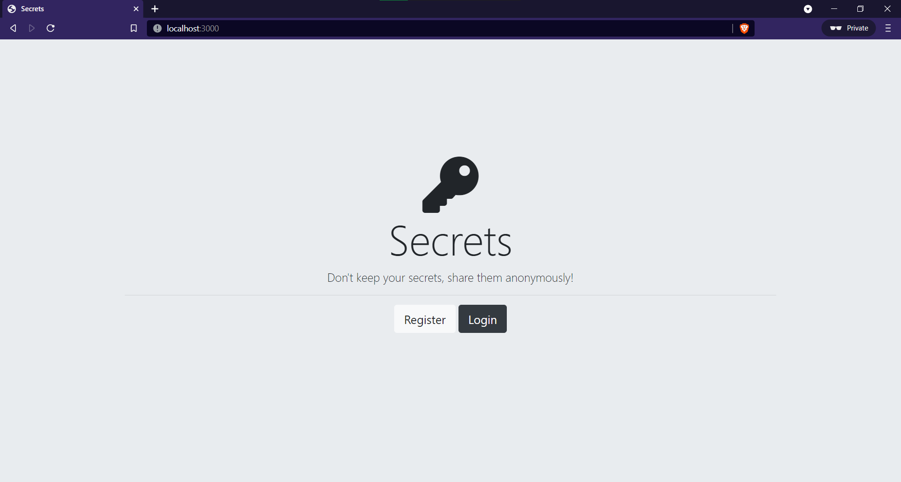
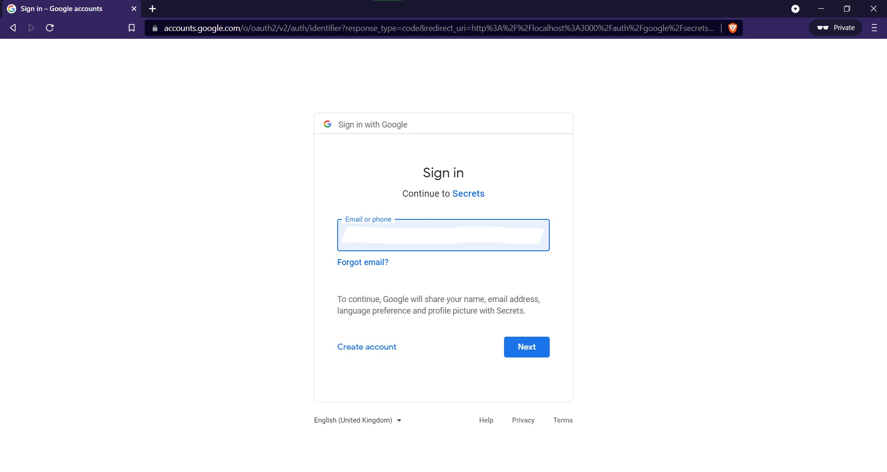
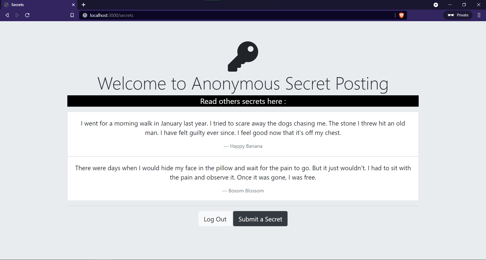
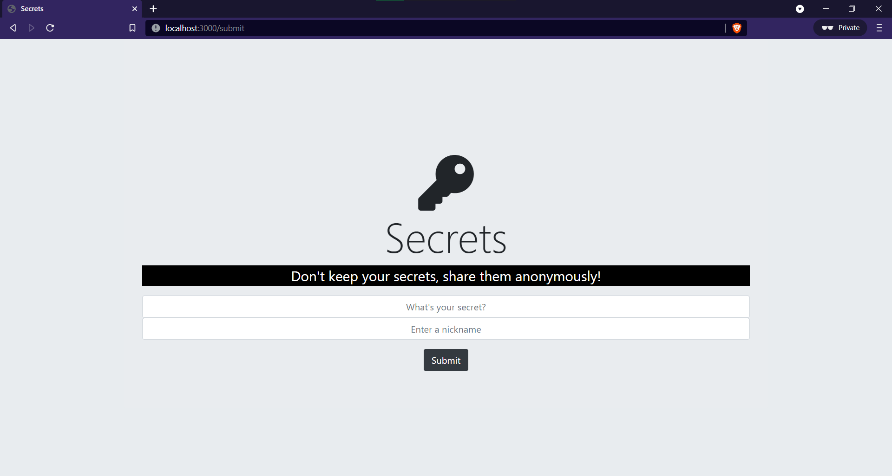

# SecretsApp
A web app that lets users log their secrets anonymously.
* Users can login localy or using their google account.
* One secret can be submitted per user.
* Submitted secret is kept anonymous.
* A nickname can be used while submitting the secret.

## Tech Stack Used

* [MongoDB](https://docs.mongodb.com/) - Document database - to store data as JSON 
* [Express.js](https://devdocs.io/express/) - Back-end web application framework running on top of Node.js
* [Node.js](https://nodejs.org/en/docs/) - JavaScript runtime environment 

### List of packages used
* [ejs](https://ejs.co/)
* [mongoose](https://mongoosejs.com/)  - ODM for MongoDB
* [express-session](https://www.npmjs.com/package/express-session)
* [passport](http://www.passportjs.org/)
* [passport-local-mongoose](https://www.npmjs.com/package/passport-local-mongoose)
* [passport-google-oauth20](http://www.passportjs.org/packages/passport-google-oauth20/)

## Screenshots

